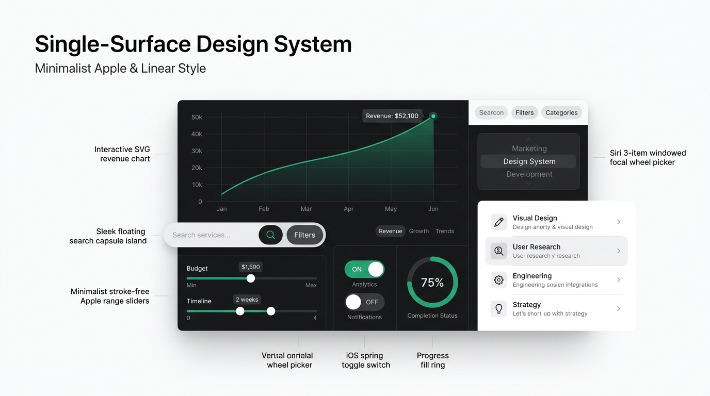

# Single-Surface Design System

> Universal Apple & Linear single-surface architecture, stroke-free controls, and fluid spring motion design system for **Web**, **iOS (SwiftUI)**, **Android (Jetpack Compose)**, and **React Native** AI agents.

[](https://xlavreniuk.github.io/single-surface-design/)
[](SKILL.md)
[](LICENSE)

---



---

## ⚡ 2-Command Quickstart

### 1. View Interactive Showroom (Instant)
View live on GitHub Pages: **[https://xlavreniuk.github.io/single-surface-design/](https://xlavreniuk.github.io/single-surface-design/)**

Or run locally with Bun:
```bash
bun run dev
```

---

### 2. Install as Skill for AI Coding Agents

Install the master `SKILL.md` into any AI workspace (Antigravity, Claude Code, Cursor, Codex):

```bash
# Antigravity / Gemini CLI
curl -sSL https://raw.githubusercontent.com/xlavreniuk/single-surface-design/main/SKILL.md -o .agents/skills/single-surface-design/SKILL.md

# Claude Code
mkdir -p .claude/skills/single-surface-design && curl -sSL https://raw.githubusercontent.com/xlavreniuk/single-surface-design/main/SKILL.md -o .claude/skills/single-surface-design/SKILL.md
```

Once installed, simply prompt your AI agent:
> *"Build the settings screen using the single-surface-design skill."*

---

## 🏛️ Design Invariants

```
+-------------------------------------------------------------------------+
|                       SINGLE FLAT SURFACE (#FFFFFF)                     |
|                                                                         |
|  [ Metric Stats ]  ------------------- Hairline Divider --------------  |
|                                                                         |
|  [ Dual-Trend SVG Chart with Numerical Axes & Live Animated Numerals ]  |
|                                                                         |
|  [ Stroke-Free Slider ]   [ Siri Focal Wheel ]   [ iOS Spring Toggle ]  |
|                                                                         |
|  [ Interactive List Rows with Negative-Margin Background Fills ]        |
+-------------------------------------------------------------------------+
```

1. **Zero Container Nesting**: Never place cards inside cards. Everything rests directly on flat `#FFFFFF`.
2. **Dividers Over Card Boxes**: Separate modules with subtle `#ECECEC` hairline dividers.
3. **Negative-Margin Hover Fills**: Interactive rows expand into `-mx-3 px-3 py-3` rounded fills on hover/press.
4. **Stroke-Free Modern Controls**: Sliders and progress bars have no heavy border strokes.
5. **Dual-Trend Data Visualization**: Emerald green (`#10B981`) for growth; Rose red (`#F43F5E`) for downturns.
6. **Live Animated Numbers**: Smooth cubic count-up transitions on all state updates.
7. **Apple Spring Physics**: `cubic-bezier(0.34, 1.56, 0.64, 1)` and `active:scale-95` on all touch targets.
8. **Strict Anti-Slop**: Zero emojis in UI controls; platform-native icons only (Lucide, SF Symbols, Material Symbols).

---

## 📱 Multi-Platform Matrix

| Platform | Framework | Core Implementation |
| :--- | :--- | :--- |
| **Web** | React / Next.js / Tailwind | `divide-y divide-[#ECECEC]`, `-mx-3 px-3 py-3 hover:bg-[#F7F7F8]`, stroke-free sliders |
| **iOS** | SwiftUI | `.background(Color.white)`, `.buttonStyle(SpringScaleButtonStyle())`, Apple springs |
| **Android** | Jetpack Compose | `Surface(color = Color.White)`, `HorizontalDivider()`, `spring(dampingRatio = ...)` |
| **Cross-Platform** | React Native / Expo | `reanimated` spring physics, stroke-free sliders, flat divider lists |

---

## 📄 License
MIT © [Andrii Lavreniuk](https://github.com/xlavreniuk)
