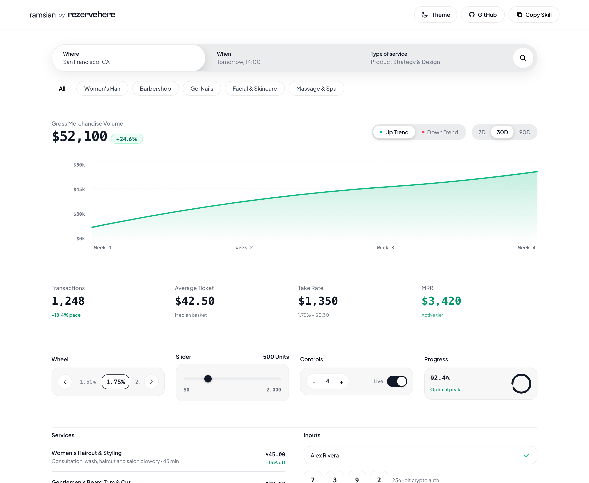

# ramsian — Single-Surface Design System

> Universal Apple & Linear single-surface architecture, stroke-free controls, Siri focal pickers, and fluid spring motion design system by **[rezervehere](https://rezervehere.com)** for **Web**, **iOS (SwiftUI)**, **Android (Jetpack Compose)**, and **React Native** AI agents. Named in honor of **Dieter Rams** (*"Weniger, aber besser / Less, but better"*).

[](https://xlavreniuk.github.io/ramsian/)
[](SKILL.md)
[](https://www.npmjs.com/package/ramsian)
[](https://pypi.org/project/ramsian/)
[](LICENSE)

---



---

## ⚡ 2-Command Quickstart

### 1. View Interactive Showroom (Instant)
View live on GitHub Pages: **[https://xlavreniuk.github.io/ramsian/](https://xlavreniuk.github.io/ramsian/)**

Or run locally with Bun / npx:
```bash
npx ramsian preview
# Or with Bun:
bun run dev
```

---

### 2. Install as Skill for AI Coding Agents

Install the master `SKILL.md` into any AI workspace (Antigravity, Claude Code, Cursor, Codex):

```bash
# 1-Line CLI Install (Recommended)
npx ramsian install

# Or via cURL into Antigravity / Gemini CLI:
curl -sSL https://raw.githubusercontent.com/xlavreniuk/ramsian/main/SKILL.md -o .agents/skills/ramsian/SKILL.md

# Or via Claude Code:
mkdir -p .claude/skills/ramsian && curl -sSL https://raw.githubusercontent.com/xlavreniuk/ramsian/main/SKILL.md -o .claude/skills/ramsian/SKILL.md

# Or via Python (pip):
pip install ramsian && ramsian install
```

Once installed, prompt any AI agent:
> *"Build the settings dashboard using the ramsian skill."*

---

## 🏛️ Core Invariants & Negative Constraints

```
+-------------------------------------------------------------------------+
|                       SINGLE FLAT SURFACE (#FFFFFF)                     |
|                                                                         |
|  [ Metric Stats ]  ------------------- Hairline Divider --------------  |
|                                                                         |
|  [ Dual-Trend SVG Chart with Numerical Axes & Live Animated Numerals ]  |
|                                                                         |
|  [ Stroke-Free Slider ]   [ Siri Focal Wheel ]   [ iOS Spring Toggle ]  |
|                                                                         |
|  [ Interactive List Rows with Negative-Margin Background Fills ]        |
+-------------------------------------------------------------------------+
```

1. 🚫 **Zero Container Nesting**: Never place gray cards inside white cards inside outer boxed cards. Controls sit directly on flat `#FFFFFF` (or dark `#09090B`).
2. 🚫 **No Yapping / Zero-Slop Text**: Ban dramatic marketing fluff (*"Live Radar & Lead Intelligence"*). Use 1-word direct functional tokens (`Wheel`, `Slider`, `Controls`, `Where`, `When`, `Service`).
3. 🚫 **Zero Emojis in UI**: Never use emojis in buttons, tabs, badges, or controls. Platform-native vector icons only (Lucide, SF Symbols, Material Symbols).
4. 🚫 **Monochrome Icons Only**: 100% monochrome vector strokes (`currentColor`). Color is strictly reserved for functional state badges (emerald for growth, rose for downturns).
5. 🔤 **Authentic Brand Typography**: Brand logo and display headers use **`Cabinet Grotesk`** (800/700 weight, strictly all-lowercase, `-0.025em` tracking). Tabular numerals use **`JetBrains Mono`**. UI body uses **`Plus Jakarta Sans`** or **`Inter`**.
6. 🔍 **60px Search Bar Composer**: 3-step auto-advance sequence (`Where` ➡️ `When` ➡️ `Type of service`) with physical sliding highlight pill and interactive month calendar / city popups.
7. 🎡 **Siri 3-Item Focal Wheel**: Centered $z\text{-index } 0$ focus box with $z\text{-index } 10$ sliding numeral track following $\text{translateX} = 60\text{px} - (i \times 60\text{px})$.
8. 📈 **Dual-Trend High-Contrast Data**: Emerald (`#047857`) / Rose (`#BE123C`) status badges with subpixel precision hover curve tracking.

---

## 📸 Automated Screenshot Utility

Capture pixel-perfect 2x Retina screenshots anytime:
```bash
bun run screenshot
```

---

## 📱 Multi-Platform Matrix

| Platform | Framework | Core Implementation |
| :--- | :--- | :--- |
| **Web** | React / Next.js / Tailwind | `divide-y divide-[#ECECEC]`, `-mx-3 px-3 py-3 hover:bg-[#F7F7F8]`, stroke-free sliders |
| **iOS** | SwiftUI | `.background(Color.white)`, `.buttonStyle(SpringScaleButtonStyle())`, Apple springs |
| **Android** | Jetpack Compose | `Surface(color = Color.White)`, `HorizontalDivider()`, `spring(dampingRatio = ...)` |
| **Cross-Platform** | React Native / Expo | `reanimated` spring physics, stroke-free sliders, flat divider lists |

---

## 📄 License
MIT © [Andrii Lavreniuk](https://github.com/xlavreniuk)
