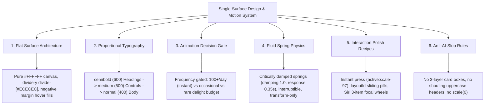

# Single-Surface Design & Fluid Motion System

> High-end, anti-AI-slop design system & AI agent skill unifying Apple fluid interfaces, Linear flat architecture, and Emil Kowalski's craft animation principles.


[](LICENSE)
[](SKILL.md)
[](principles/07-fluid-spring-physics.md)
[](https://tailwindcss.com)
[](https://bun.sh)

---

## What is Single-Surface Design?

AI coding assistants frequently generate **AI Slop**:
* Nesting gray cards inside white cards inside outer card wrappers (3-4 layers deep).
* Screaming uppercase micro-headers (`CONTACT DETAILS`, `WHAT'S INCLUDED`).
* Distorted, overly heavy `font-black` typography.
* Choppy mobile scroll caused by unoptimized backdrop filters.
* Wrong motion ingredients: `scale(0)` pops, sluggish `ease-in` entrances, and animating keyboard actions.

**Single-Surface Design** provides a strict, opinionated framework to ensure every component generated by humans or AI agents feels calm, physically grounded, responsive, and crafted with taste.

---

## The 6 Core Architectural Pillars



---

## Before vs. After Comparison

| Feature | Generic AI-Slop Design | Single-Surface Standard |
| :--- | :--- | :--- |
| **Container Hierarchy** | Outer boxed card with nested gray cards inside | **Pure `#FFFFFF` canvas** with clean borderless divider rows (`divide-y divide-[#ECECEC]`) |
| **Typography Scale** | Mixed `font-black`, `font-extrabold`, and screaming uppercase labels | **Proportional scale**: `font-semibold` (Headings) $\to$ `font-medium` (Buttons) $\to$ `font-normal` (Body) |
| **Motion Gating** | Animating everything (including command palette & keyboard shortcuts) | **Frequency-Gated**: High-frequency actions are instant; modals/drawers use physical springs |
| **Spring Physics** | Arbitrary `cubic-bezier(0.4, 0, 0.2, 1)` or linear transitions | **Apple WWDC Springs**: Critically damped ($\zeta = 1.0$) for standard UI; momentum ($\zeta = 0.8$) for swipes |
| **Press Feedback** | Latency waiting for `click` / touch-up | **Instant `pointerdown`**: `active:scale-[0.97]` responsive button press |
| **Header Scroll** | Heavy blurred header causing mobile scroll lag | **GPU hardware compositing** (`[transform:translateZ(0)]`) for smooth 60fps scrolling |

---

## How to Use This Skill in Any Project

### Option A: Install in Antigravity / Gemini CLI
Copy `SKILL.md` into your project's skill directory:
```bash
mkdir -p .agents/skills/single-surface-design
cp /path/to/single-surface-design/SKILL.md .agents/skills/single-surface-design/
```

### Option B: Install in Claude Code
Copy `SKILL.md` into `.claude/skills/`:
```bash
mkdir -p .claude/skills/single-surface-design
cp /path/to/single-surface-design/SKILL.md .claude/skills/single-surface-design/
```

---

## Complete Principle Guides

Explore the detailed architecture guides in [`principles/`](principles/):

1. [`principles/01-flat-surface-architecture.md`](principles/01-flat-surface-architecture.md) — Single-surface layout, negative margins, borderless list rows.
2. [`principles/02-proportional-typography.md`](principles/02-proportional-typography.md) — Font weight hierarchy, optical tracking, sentence case.
3. [`principles/03-anti-ai-slop-rules.md`](principles/03-anti-ai-slop-rules.md) — Invariants to prevent generic AI UI patterns.
4. [`principles/04-hardware-layer-compositing.md`](principles/04-hardware-layer-compositing.md) — GPU acceleration, blur performance, mobile 60fps.
5. [`principles/05-frequency-based-animation-gating.md`](principles/05-frequency-based-animation-gating.md) — When to animate vs. when to stay instant.
6. [`principles/06-spatial-consistency-and-origin-matching.md`](principles/06-spatial-consistency-and-origin-matching.md) — Geometry, shared layout morphs.
7. [`principles/07-fluid-spring-physics.md`](principles/07-fluid-spring-physics.md) — Damping ratios, response curves, interruptibility.
8. [`principles/08-instant-feedback-and-interruptibility.md`](principles/08-instant-feedback-and-interruptibility.md) — Active press physics, gesture handoffs.
9. [`principles/09-ios-windowed-focal-pickers.md`](principles/09-ios-windowed-focal-pickers.md) — Siri 3-item focal wheels, directional sliding physics.
10. [`principles/10-linear-style-command-palettes.md`](principles/10-linear-style-command-palettes.md) — Keyboard speed, zero-latency filters.

---

## License

MIT © [Andrii Lavreniuk](https://github.com/xlavreniuk)
