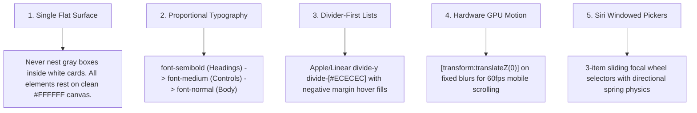

# Single-Surface Design Language

> High-end, anti-AI-slop design system & AI agent skill inspired by Apple & Linear.

[](LICENSE)
[](SKILL.md)
[](https://tailwindcss.com)
[](https://bun.sh)

---

## 🎯 What is Single-Surface Design?

AI coding assistants (Claude, ChatGPT, Cursor, Gemini) frequently suffer from **"AI Slop"**:
* ❌ Nesting gray cards inside white cards inside outer card wrappers (3-4 layers deep).
* ❌ Screaming uppercase micro-headers (`1. CONTACT DETAILS`, `WHAT'S INCLUDED`).
* ❌ Distorted, overly heavy `font-black` typography.
* ❌ Choppy mobile scroll caused by unoptimized backdrop filters.

**Single-Surface Design** provides a strict, opinionated framework to ensure every page generated by humans or AI agents feels calm, proportional, bespoke, and physically grounded.

---

## 🏛️ The 5 Core Principles



---

## 🎨 Before vs. After Comparison

| Feature | ❌ Generic AI-Slop Design | ✅ Single-Surface Standard |
| :--- | :--- | :--- |
| **Container Hierarchy** | Outer boxed card with nested gray cards inside | **Pure `#FFFFFF` canvas** with clean borderless divider rows (`divide-y divide-[#ECECEC]`) |
| **Typography Scale** | Mixed `font-black`, `font-extrabold`, and screaming uppercase labels | **Proportional scale**: `font-semibold` (Headings) $\to$ `font-medium` (Buttons) $\to$ `font-normal` (Body) |
| **Form Layout** | 4-5 stacked boxed cards on gray background | **Single continuous form** on pure `#FFFFFF` divided by subtle border dividers |
| **Header Scroll** | Heavy blurred header causing mobile scroll lag | **GPU hardware compositing** (`[transform:translateZ(0)]`) for smooth 60fps scrolling |
| **Interactive Rows** | Boxed cards with heavy borders | **Negative-margin rows** (`-mx-4 px-4 hover:bg-[#F7F7F8] rounded-2xl`) |

---

## 📦 How to Use This Skill in Any Project

### Option A: Install in Antigravity / Gemini CLI
Copy `SKILL.md` into your project's skill directory:
```bash
mkdir -p .agents/skills/single-surface-design
cp /path/to/single-surface-design/SKILL.md .agents/skills/single-surface-design/
```

### Option B: Install in Claude Code
Copy `SKILL.md` into `.claude/skills/`:
```bash
mkdir -p .claude/skills/single-surface-design
cp /path/to/single-surface-design/SKILL.md .claude/skills/single-surface-design/
```

---

## 🎨 Design Tokens

### Color Palette
```css
/* Surface Colors */
--bg-canvas: #FFFFFF;
--bg-subtle-hover: #F7F7F8;
--bg-active-fill: #EBECEE;

/* Text Tokens */
--text-primary: #111827;    /* High-contrast brand dark */
--text-secondary: #4B5563;  /* Balanced body text */
--text-muted: #6B7280;      /* Subtle metadata & timestamps */
--text-placeholder: #9CA3AF;/* Input placeholders */

/* Borders & Dividers */
--border-subtle: #ECECEC;   /* Primary divider lines */
--border-control: #E5E7EB;  /* Button & input borders */
```

### Typography Hierarchy
```css
/* Display & Headings */
.heading-primary {
  font-family: var(--font-display);
  font-weight: 600; /* font-semibold */
  letter-spacing: -0.025em;
  color: #111827;
}

/* Controls & Buttons */
.control-pill {
  font-weight: 500; /* font-medium */
  font-size: 0.75rem; /* 12px */
  border-radius: 9999px;
}

/* Body & Metadata */
.body-text {
  font-weight: 400; /* font-normal */
  color: #4B5563;
  line-height: 1.625;
}
```

---

## 🧩 Ready-to-Use Component Templates

Check the [`components/`](components/) directory for copy-paste React + Tailwind CSS recipes:
* [`FrostedHeader.tsx`](components/FrostedHeader.tsx): GPU-accelerated frosted glass header.
* [`SingleSurfaceHero.tsx`](components/SingleSurfaceHero.tsx): Open, unboxed profile hero.
* [`DividerListRow.tsx`](components/DividerListRow.tsx): Borderless interactive list row with hover fills.
* [`SiriFocalPicker.tsx`](components/SiriFocalPicker.tsx): 3-item sliding focal wheel selector.
* [`CleanLanguageDropdown.tsx`](components/CleanLanguageDropdown.tsx): Solid opaque language switcher.
* [`ContinuousForm.tsx`](components/ContinuousForm.tsx): Continuous single-surface form with dynamic slot grid.

---

## 📄 License
This project is open-source under the [MIT License](LICENSE).
