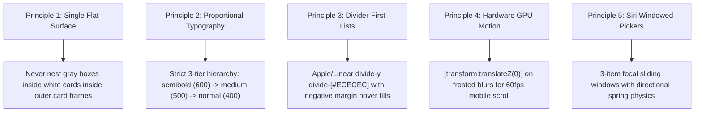

# Single-Surface Design Language (Anti-AI-Slop Standard)

This skill guides AI coding assistants in crafting high-end, human-feeling, production-ready frontend interfaces following the **Single-Surface Apple & Linear design philosophy**. It eliminates generic "AI slop" (multi-level boxed card nesting, aggressive bolding, screaming uppercase headers, and clunky container frames).

---

## 🏛️ The 5 Core Design Principles



---

## 1. The Single-Surface Principle (Anti-AI-Slop)
* **The Golden Rule**: Never place gray cards inside white cards inside outer boxed cards.
* **Canvas Elevation**: All primary content sits directly on the clean `#FFFFFF` canvas. 
* **Interactive Boundaries**: Instead of boxing every element in a `<div className="border rounded-2xl p-6">`, use subtle divider lines (`border-t border-[#ECECEC]`) or borderless interactive rows styled with `hover:bg-[#F7F7F8] rounded-xl`.

---

## 2. Proportional 3-Tier Typography Scale

| Hierarchy Tier | Font Weight | Tailwind Token | Applied To |
| :--- | :--- | :--- | :--- |
| **Tier 1: Headings & Names** | `600` (SemiBold) | `font-semibold` | Brand logos, page headings (24–32px), salon/item titles, primary section headers. |
| **Tier 2: Controls & Actions** | `500` (Medium) | `font-medium` | Interactive pill buttons (`Book`, `Save`, `Share`), tabs, chips, form labels. |
| **Tier 3: Body & Metadata** | `400` (Normal) | `font-normal` | Descriptions, addresses, timestamps, durations, review comments, footer links. |

> [!WARNING]
> **No Exaggerated Weights**: Avoid aggressive `font-black` (900) or heavy `font-extrabold` (800) in body or headings. Overly heavy weights distort optical kerning and feel like cheap templates.

---

## 3. Strict Anti-AI-Slop Checklist

1. ❌ **No Nested Box Clutter**: Drop outer gray cards around forms. Use open, continuous single-layer forms.
2. ❌ **No Screaming Uppercase Micro-Headers**: Replace `1. CONTACT DETAILS` or `POPULAR SERVICES` with clean, elegant title case: `Your Details` or `Available Services`.
3. ❌ **No Duplicate Subtitle Redundancy**: Never repeat the title as a subtitle on the right side of the same row (e.g. `Haircut · Haircut`).
4. ❌ **No Solid White Input Cutouts**: Search capsule and form inputs must use `!bg-transparent` so input fields never render a solid white rectangle over hover backgrounds.
5. ❌ **Zero Outer Padding (`p-0`) on Capsules**: Search capsules and segmented controls must use `p-0` so hover highlights cover 100% of height and curved pill radius.
6. ❌ **No Multi-Border Divides**: Avoid stacking `border-t` and `border-b` around floating popups or menus. Use single-surface panels (`bg-white rounded-2xl border border-[#E5E7EB] shadow-[0_12px_36px_rgba(0,0,0,0.12)] p-1.5`).
7. ❌ **No Heavy Box Accordions**: Prefer borderless Apple/Linear divider accordions (`divide-y divide-[#ECECEC]`) over individual floating boxed cards for FAQs and options.

---

## 4. Design Tokens & Palette

```css
/* Surface Colors */
--bg-canvas: #FFFFFF;
--bg-subtle-hover: #F7F7F8;
--bg-active-fill: #EBECEE;

/* Text Hierarchy */
--text-primary: #111827;    /* High-contrast brand dark */
--text-secondary: #4B5563;  /* Balanced body text */
--text-muted: #6B7280;      /* Subtle metadata & timestamps */
--text-placeholder: #9CA3AF;/* Input placeholders */

/* Borders & Dividers */
--border-subtle: #ECECEC;   /* Primary divider lines */
--border-control: #E5E7EB;  /* Button & input borders */

/* Shadows */
--shadow-subtle: 0 1px 2px rgba(0, 0, 0, 0.04);
--shadow-elevated: 0 12px 36px rgba(0, 0, 0, 0.12);
```

---

## 5. Apple/Linear Divider-First Row Pattern

When rendering lists of services, options, or items, use borderless rows with negative margin hover fills:

```tsx
<div className="divide-y divide-[#ECECEC] border-t border-b border-[#ECECEC]">
  {items.map((item) => (
    <div 
      key={item.id} 
      className="group py-4 px-3 sm:px-4 -mx-3 sm:-mx-4 rounded-2xl hover:bg-[#F7F7F8] transition-colors flex items-center justify-between gap-4"
    >
      <div className="space-y-1 flex-1 text-left">
        <h3 className="font-semibold text-sm sm:text-base text-[#111827]">
          {item.title}
        </h3>
        <p className="text-xs font-normal text-[#4B5563] leading-relaxed">
          {item.description}
        </p>
      </div>

      <div className="flex items-center gap-4 shrink-0">
        <span className="font-semibold text-base text-[#111827]">€{item.price.toFixed(2)}</span>
        <button className="h-8.5 px-4 rounded-full bg-[#111827] hover:bg-[#262626] text-white text-xs font-medium transition-all active:scale-95">
          Select
        </button>
      </div>
    </div>
  ))}
</div>
```

---

## 6. Hardware GPU-Accelerated Header Pattern

```tsx
<header className="fixed top-0 left-0 right-0 z-50 bg-white/90 backdrop-blur-md [transform:translateZ(0)] border-b border-[#ECECEC] h-16 md:h-20 flex items-center shadow-2xs px-6 md:px-12">
  <div className="max-w-4xl w-full mx-auto flex items-center justify-between gap-4">
    <span className="font-display font-semibold text-xl md:text-2xl text-[#111827] tracking-tight">
      brandname
    </span>
    {/* Navigation Controls */}
  </div>
</header>
```

---

## 7. Siri 3-Item Windowed Focal Wheel Pickers

* Displays only 3 items at a time: previous adjacent step, center active focus, next adjacent step.
* Directional sliding animations: text slides right-to-left when stepping forward, left-to-right when stepping backward using spring physics (`stiffness: 480, damping: 34`).
* Center focus pill supports direct typing of custom decimal values with instant bidirectional state recalculations.
