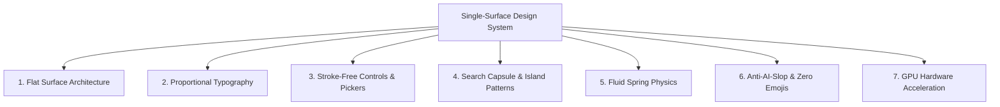

# Single-Surface Design & Fluid Motion Engineering

A universal, opinionated design engineering standard for crafting interfaces that feel calm, physically grounded, responsive, and completely free of generic "AI slop".

Whenever this skill is referenced in **ANY project**, the agent **MUST ALWAYS enforce this exact design standard** for all UI components, pages, forms, and layouts.

---

## 🏛️ The 7 Core Architectural Invariants



---

## 1. Single-Surface Architecture (Zero Box Nesting)
* **The Fundamental Rule**: Never place gray cards inside white cards inside outer boxed card frames.
* **Canvas Elevation**: Primary content sits directly on flat pure white `#FFFFFF`.
* **Divider-First Structure**: Separate list items, metrics, and sections using subtle divider lines (`divide-y divide-[#ECECEC]` or `border-t border-b border-[#ECECEC]`).
* **Negative-Margin Hover Expansion**: Interactive rows expand into outer container padding on hover:
  ```tsx
  <div className="group py-3.5 px-3 -mx-3 rounded-2xl hover:bg-[#F7F7F8] transition-colors flex items-center justify-between cursor-pointer">
    <div className="space-y-0.5 text-left">
      <h4 className="font-semibold text-xs text-[#111827]">{service.name}</h4>
      <p className="text-xs font-normal text-[#6B7280]">{service.description}</p>
    </div>
    <span className="font-semibold text-xs text-[#111827]">€{service.price}</span>
  </div>
  ```

---

## 2. Proportional Typography Hierarchy
* **Headings & Brand**: `font-semibold` (`600`) — 16px to 28px. Never use distorted `font-black` (900) or shouting uppercase labels.
* **Buttons, Controls & Pills**: `font-medium` (`500`) or `font-semibold` (`600`) — 12px to 14px.
* **Body, Subtitles & Metadata**: `font-normal` (`400`) — 12px to 14px text in `#4B5563` or `#6B7280`.
* **Numerals, Pricing & Dates**: `font-mono` (`JetBrains Mono` / `Inter`) — Tabular figures for alignment.

---

## 3. Stroke-Free Controls & Custom Apple Sliders
Never render ugly native range slider borders, outlines, or heavy box shadows:
```css
input[type=range] {
  -webkit-appearance: none;
  appearance: none;
  background: #EBECEE;
  height: 6px;
  border-radius: 9999px;
  outline: none;
  border: none !important;
  box-shadow: none !important;
}
input[type=range]::-webkit-slider-thumb {
  -webkit-appearance: none;
  appearance: none;
  width: 18px;
  height: 18px;
  background: #111827;
  border-radius: 50%;
  cursor: pointer;
  border: 2px solid #FFFFFF !important;
  box-shadow: 0 2px 5px rgba(0,0,0,0.18);
  transition: transform 0.12s cubic-bezier(0.4, 0, 0.2, 1);
}
input[type=range]::-webkit-slider-thumb:hover { transform: scale(1.15); }
input[type=range]::-webkit-slider-thumb:active { transform: scale(0.95); }
```

---

## 4. Search Island Capsule Pattern
* Form wrapper uses `p-0` so hover fills cover 100% of capsule height and curved ends.
* Active segment is highlighted with **pure white background and elevation shadow**:
  `bg-white shadow-[0_4px_20px_rgba(0,0,0,0.12)] rounded-full z-10`
* Dividing lines automatically hide (`opacity-0`) when an adjacent segment is active.
* Horizontal auto-advance flow: `Where` ➡️ `When` ➡️ `Service`.

---

## 5. Siri 3-Item Windowed Focal Wheel Pickers
* Displays exactly 3 items at a time: previous step (muted), center focus pill (bold/active), next step (muted).
* Physical directional sliding animation: slides right-to-left when stepping forward, left-to-right when stepping backward.
* Spring physics: `stiffness: 480, damping: 34`.

---

## 6. Anti-AI-Slop & Zero Emojis Standard
* **Zero Emojis**: Never use emojis in button labels, tables, dialogs, or generated outreach templates. Always use clean vector **Lucide SVG icons**.
* **Zero Gimmicky Badges**: Never add artificial "AI Powered", "Radar Active", or "Engine Ready" pulsating badges.
* **No Screaming Uppercase**: Replace uppercase micro-headers (`SUGGESTED DESTINATIONS`, `WHAT'S INCLUDED`) with natural sentence/title case.
* **No Boxed Metric Tiles**: Replace 4-5 side-by-side gray boxed tiles with a single flat divider row (`grid grid-cols-4 py-4 border-t border-b border-[#ECECEC]`).

---

## 7. GPU Hardware Acceleration & Mobile 60fps
* All sticky or fixed frosted glass topbars must include `[transform:translateZ(0)]`:
  ```html
  <header className="fixed top-0 left-0 right-0 z-50 bg-white/90 backdrop-blur-md [transform:translateZ(0)] border-b border-[#ECECEC] h-16">
  ```
* Prevents mobile scroll jitter and forces GPU rasterization.

---

## Interactive Playground & Live Web Editor
To preview, inspect, edit tokens, and export components live in your browser:
```bash
bun run server.ts
# Open http://localhost:3002
```
