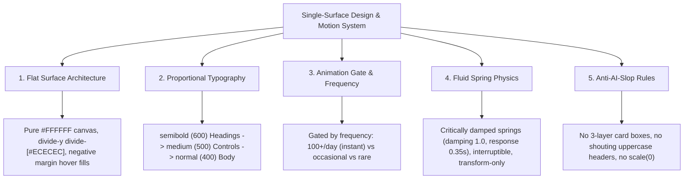

# Single-Surface Design & Fluid Motion Engineering

A comprehensive design engineering standard for crafting interfaces that feel calm, physically grounded, responsive, and free of generic "AI slop". It unifies:
1. **The Single-Surface Architecture** (Zero container-in-container nesting, pure `#FFFFFF` canvas, divider-first lists).
2. **Proportional Typography Scale** (`font-semibold` $\to$ `font-medium` $\to$ `font-normal`).
3. **Emil Kowalski's Craft Polish** (Subtle compounding details, press states, exact easing curves, zero unearned motion).
4. **Apple WWDC Fluid Motion & Spring Physics** (Interruptibility, 1:1 direct tracking, velocity handoff, `transform` + `opacity` only).

---

## 🏛️ The Core Architectural Pillars



---

## 1. Single-Surface Architecture & Divider-First Lists

* **The Core Rule**: Never place gray cards inside white cards inside outer card frames.
* **Canvas Elevation**: Primary surfaces rest on pure `#FFFFFF`.
* **Subtle Separation**: Separate list items with Apple/Linear divider lines (`divide-y divide-[#ECECEC] border-t border-b border-[#ECECEC]`).
* **Negative-Margin Hover Expansion**: Interactive rows expand into container padding on hover:
  ```tsx
  <div className="group py-4 px-3 sm:px-4 -mx-3 sm:-mx-4 rounded-2xl hover:bg-[#F7F7F8] transition-colors flex items-center justify-between">
    <div className="space-y-0.5 text-left">
      <h3 className="font-semibold text-sm text-[#111827]">{item.title}</h3>
      <p className="text-xs font-normal text-[#4B5563]">{item.description}</p>
    </div>
    <span className="font-semibold text-sm text-[#111827]">€{item.price.toFixed(2)}</span>
  </div>
  ```

---

## 2. Proportional Typography Hierarchy

| Tier | Weight | Tailwind Class | Usage Scope |
| :--- | :--- | :--- | :--- |
| **Tier 1: Headings & Names** | `600` | `font-semibold` | Brand logos, page headers (20–32px), treatment names, reviewer names. |
| **Tier 2: Controls & Actions** | `500` | `font-medium` | Button pills (`Book`, `Save`, `Share`), tabs, chips, form labels. |
| **Tier 3: Body & Metadata** | `400` | `font-normal` | Descriptions, addresses, opening hours, durations, timestamps, review text. |

> [!WARNING]
> **No Exaggerated Weights**: Avoid aggressive `font-black` (900) or heavy `font-extrabold` (800) in body or headings. Overly heavy weights distort optical kerning.

---

## 3. The Animation Decision Gate (Emil Kowalski Framework)

Before writing any motion code, evaluate the **Frequency Gate**:

| Action Frequency | Decision | Implementation |
| :--- | :--- | :--- |
| **100+ times/day** (keyboard shortcuts, command palette, tabs) | **NO animation. Ever.** | Instant state change. Zero latency. |
| **Tens of times/day** (hover effects, list navigation) | **Near-imperceptible** | `100ms - 150ms ease-out` on transform/opacity. |
| **Occasional** (modals, drawers, dropdowns) | **Standard physical animation** | Critically damped spring or `200ms ease-out`. |
| **Rare / First-time** (onboarding, success screens) | **Delight allowed** | Smooth sequence with playful physics. |

> [!IMPORTANT]
> **Never animate keyboard-initiated actions.** Raycast and Spotlight open instantly without transitions — this is the gold standard for high-frequency actions.

---

## 4. Physical Motion Rules & Properties

1. **Only Animate `transform` and `opacity`**:
   * Skips layout and paint steps, running purely on the GPU compositing thread.
   * Never animate `top`, `left`, `width`, `height`, `margin`, or `padding`.
2. **Never Start From `scale(0)`**:
   * Nothing in the physical world appears from a mathematical singularity.
   * Entrances start from `scale(0.95)` with `opacity: 0` $\to$ `scale(1)` with `opacity: 1`.
3. **`transform-origin` Anchoring**:
   * Dropdowns, menus, and popovers scale outward from their trigger button (`transform-origin: var(--transform-origin)` or top-right). Modals stay centered.
4. **Instant Press Feedback (Pointer-Down)**:
   * Buttons must react immediately when pressed (`active:scale-[0.97] transition-transform duration-100 ease-out`).
5. **GPU Rasterization Layer**:
   * Fixed and sticky blurred elements must use `[transform:translateZ(0)]` to force GPU compositing and prevent mobile scroll lag.

---

## 5. Apple WWDC Fluid Spring Physics

```ts
// 1. Critically Damped Spring (Default for 90% of UI — no distracting overshoot)
const standardSpring = {
  type: "spring",
  stiffness: 480,
  damping: 34, // damping ratio ~ 1.0 (critically damped)
  mass: 1,
};

// 2. Physical Momentum Spring (Reserved strictly for swipe, throw, or drag release)
const momentumSpring = {
  type: "spring",
  stiffness: 400,
  damping: 26, // damping ratio ~ 0.8 (gentle, satisfying settle)
  mass: 1,
};
```

---

## 6. Strict Anti-AI-Slop Checklist (Zero Tolerance)

* ❌ **No 3-Layer Boxed Nesting**: Drop outer gray wrapper cards around inputs/forms. Controls sit directly on flat `#FFFFFF`.
* ❌ **No Gimmicky Status Badges**: Never add fake "Engine Ready", pulsing green dots, "AI Powered", or "Radar Active" badges unless requested.
* ❌ **No Cheesy Marketing Jargon / Slop Text**: Avoid fluff like "Live Radar & Lead Intelligence", "City Scanner & Live Radar", "Radar Idle". Use calm, minimal, human labels (`Scan`, `City`, `Market Overview`, `Salons`).
* ❌ **No Boxed Metric Tiles**: Never put 4 separate gray cards side-by-side for numbers. Use a single flat divider row (`grid grid-cols-4 py-4 border-t border-b border-[#ECECEC]`).
* ❌ **No Screaming Uppercase Headers**: Change `1. CONTACT DETAILS` to `Your details`.
* ❌ **No Duplicated Subtitles**: Never show redundant label repetition (e.g. `Haircut · Haircut`).
* ❌ **No Solid White Input Boxes**: Capsule search fields must include `!bg-transparent`.
* ❌ **Zero Outer Padding (`p-0`) on Capsules**: Hover fills must touch 100% of height and curved edges.
* ❌ **No Multi-Border Divides**: Avoid dividing floating popups with stacked borders.
* ❌ **No Nested Accordion Cards**: Details/sub-items must expand into flat borderless divider lines (`divide-y divide-[#ECECEC]`), never inner boxed cards.
