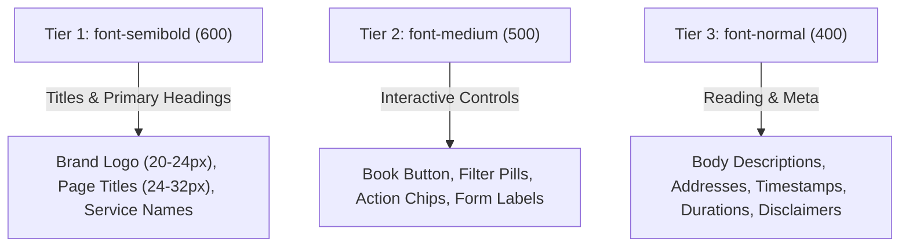

# Principle 2: Proportional Typography Hierarchy

## The Optical Weight Problem
AI agents frequently default to `font-extrabold` (800) or `font-black` (900) for every heading, title, and button. When every element screams with heavy ink weight, the layout loses visual hierarchy and kerning looks clumsy.

---

## The Proportional 3-Tier Scale

---

## Typography Tokens

* **Display / Brand**: Cabinet Grotesk or Inter (`font-semibold tracking-tight text-[#111827]`).
* **Section Titles**: `font-semibold text-lg sm:text-xl text-[#111827]`.
* **Action Pills / Buttons**: `text-xs font-medium text-white bg-[#111827] rounded-full`.
* **Metadata & Secondary Details**: `text-xs font-normal text-[#6B7280]`.
* **Body Descriptions**: `text-sm font-normal text-[#4B5563] leading-relaxed`.
